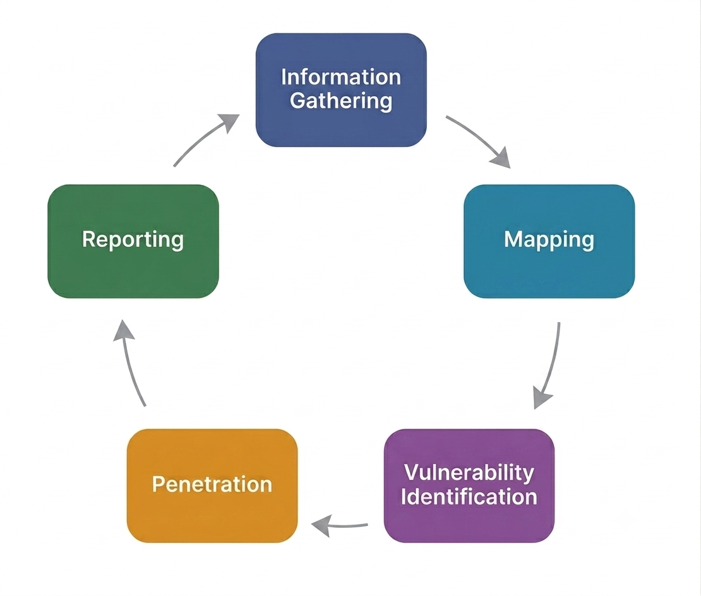

### <span style="color:rgb(192, 0, 0)">1- Executive Summary</span>

A security assessment was conducted against the **WAPTLab – Benchmark CRM** application to evaluate its security posture and identify vulnerabilities that could impact the confidentiality, integrity, and availability of the system.

The assessment combined manual penetration testing techniques with targeted verification of common web application security weaknesses based on the **OWASP Top 10 (2021)** methodology.

A total of **10 security findings** were identified during the assessment.

| Severity                                                        | Count |
| --------------------------------------------------------------- | ----- |
| <span style="color:rgb(192, 0, 0)"><b>Critical</b></span>       | 1     |
| <span style="color:rgb(192, 0, 0)"><b>High</b></span>           | 4     |
| <span style="color:rgb(255, 192, 0)"><b>Medium</b></span>       | 4     |
| <span style="color:rgb(0, 176, 80)"><b>Informational</b></span> | 1     |

The most significant finding was the exposure of an **unauthenticated Elasticsearch REST API**, allowing any unauthenticated user to directly access indexed application data and perform unauthorized read and write operations. Although the underlying database remained unaffected due to synchronization mechanisms, the exposed search index could be manipulated and sensitive information disclosed.

Additional High-Risk vulnerabilities included:

- Server-Side Template Injection (SSTI), potentially leading to remote code execution depending on server configuration.
- Server-Side Request Forgery (SSRF), allowing authenticated users to access internal network resources.
- Stored Cross-Site Scripting (Stored XSS) affecting multiple application components.
- XML External Entity (XXE) processing leading to sensitive file disclosure.

Several Medium-Risk findings were also identified, including:

- Broken Access Control allowing unauthorized access to administrative data.
- Open Redirect.
- Information Disclosure caused by an exposed Vite development server.

Finally, one Informational finding identified the use of an outdated **CKEditor 4.14.0** version affected by multiple publicly disclosed security vulnerabilities. Although exploitation was not demonstrated during testing, upgrading the component is recommended to reduce future risk.

Overall, the assessment indicates that the application contains multiple security weaknesses across authentication, authorization, input validation, server configuration, and third-party component management. Addressing the High and Critical findings should be prioritized to significantly improve the application's security posture.


---
### <span style="color:rgb(192, 0, 0)">2- Target</span>


| Application      | WAPTLab – Benchmark CRM                                                                                          |
| ---------------- | ---------------------------------------------------------------------------------------------------------------- |
| **Performed By** | - Mostafa Khalil<br>- Ahmed Saqr<br>- Zaid Mohamed<br>- Mohamed Quandil<br>- Mohmed Sallam<br>- Mahmoud El Nagar |


---
### <span style="color:rgb(192, 0, 0)">3- Assessment Methodology</span>




#### Information Gathering Phase

The tester uses information gathering techniques to find all available information about the target scope using both technical and social methods *(Note: the social engineering part was not conducted).*

##### Activities Included in This Phase:

* **Identify application business requirements:** Understanding the core logic and business goals of the application.
* **Identify the different users:** Mapping out the various user roles and the permissions allocated to each of them.
* **Understand application technologies:** Discovering the underlying technologies, frameworks, and third-party integrations used.
* **Identify applied security controls:** Locating existing security mechanisms built into the application.
* **Spidering the application:** Crawling the application structure to map out and discover all available directories and paths.
* **OSINT searching:** Conducting Open Source Intelligence to find any leaked or published information/code on public repositories (like GitHub).
* **Open ports scanning:** Identifying open ports and services running on the target system.
* **Identify connections:** Mapping the communication links and data flow between the client application and the server.
* **Analyze the client application:** Reviewing the client-side code/application to gain a deeper understanding of its operation.


#### Vulnerability Identification
 

During this phase, the application was systematically assessed for common web application vulnerabilities, including but not limited to:

##### Authentication & Authorization

Verification of authentication mechanisms, session management, privilege separation, and access control enforcement to identify unauthorized access opportunities.

##### Broken Access Control

Assessment of object-level and function-level authorization to determine whether users can access resources or perform actions beyond their intended permissions.
##### Injection

Testing user-controlled input for unsafe interaction with backend components, including SQL Injection and other injection flaws resulting from insufficient input validation.

##### Cross-Site Scripting (XSS)

Evaluation of user input handling to identify opportunities for client-side script injection that could compromise user sessions or application integrity.

##### File Upload & File Processing

Assessment of file upload, import, and parsing functionality for insecure validation, unsafe processing, and improper handling of untrusted files.
##### Security Misconfiguration

Review of application and infrastructure configuration to identify exposed services, unnecessary functionality, insecure defaults, and improper deployment settings.

##### Vulnerable & Outdated Components

Identification of third-party libraries, frameworks, and software versions known to contain publicly disclosed security vulnerabilities.

##### Sensitive Data Exposure

Assessment of how sensitive information is stored, transmitted, and exposed to determine whether confidential data is adequately protected.
##### Business Logic Flaws

Analysis of application workflows to identify weaknesses arising from incorrect implementation of business processes rather than technical vulnerabilities.

----

### <span style="color:rgb(192, 0, 0)">4- Findings</span>

#### 4.1 

| Title               | Unauthenticated Exposure of Elasticsearch REST API Leading to Unauthorized Read/Write Access<br>-                                                                                                                                                                                                                                                                                                                                                                                                                             |
| ------------------- | ----------------------------------------------------------------------------------------------------------------------------------------------------------------------------------------------------------------------------------------------------------------------------------------------------------------------------------------------------------------------------------------------------------------------------------------------------------------------------------------------------------------------------- |
| **OWASP Category**  | [A05:2021 – Security Misconfiguration](https://owasp.org/Top10/2021/A05_2021-Security_Misconfiguration/)                                                                                                                                                                                                                                                                                                                                                                                                                      |
| **Description**     | The application exposes its Elasticsearch REST API directly on port `9200` without any authentication or authorization. <br>Any attacker able to reach this service can enumerate indices, read indexed documents, modify existing documents, create new ones, and delete data without possessing valid application credentials.<br><br>The application dashboard consumes data from Elasticsearch, making unauthorized modifications immediately visible to users until the synchronization process restores the index.<br>- |
| **Recommendations** | Disable public exposure of Elasticsearch, bind it to an internal network only, remove host port mapping in production, upgrade to a supported Elasticsearch version, enable authentication/authorization (Elastic Security), and enforce least-privilege access between the application and Elasticsearch.<br>-                                                                                                                                                                                                               |
| **Affected Path**   | `http://localhost:9200/`                                                                                                                                                                                                                                                                                                                                                                                                                                                                                                      |
| **Threat Level**    | <span style="color:rgb(192, 0, 0)"><b>8.6 (High)</b></span>                                                                                                                                                                                                                                                                                                                                                                                                                                                                   |
| **Risk Score**      | **CVSS:3.1/AV:N/AC:L/PR:N/UI:N/S:U/C:H/I:L/A:L**                                                                                                                                                                                                                                                                                                                                                                                                                                                                              |

#### Steps to Reproduce

1- Port Scanning using `nmap`


2- Verify the Exposed Elasticsearch Service using Burp Suite Proxy


3- Enumerate Existing Indices


4- Read the documents of the 3 indices `admin_data , support_data , hr_data` 


5- Modify Existing Document


Dashboard Before


Dashboard After


==But After a small period of time → the Re-Indexing happens and the original data appears again==

6- Delete a Document


==But After a small period of time → the Re-Indexing happens and the original data appears again==

6- Add a new Document


----
#### 4.2


| Title               | Broken Access Control in `db` Parameter Allows Unauthorized Access to Administrative Data<br>-                                                                                                                                                                                                                                                                                                                                                                                                                                     |
| ------------------- | ---------------------------------------------------------------------------------------------------------------------------------------------------------------------------------------------------------------------------------------------------------------------------------------------------------------------------------------------------------------------------------------------------------------------------------------------------------------------------------------------------------------------------------- |
| **OWASP Category**  | [A01:2021 – Broken Access Control](https://owasp.org/Top10/2021/A01_2021-Broken_Access_Control/)                                                                                                                                                                                                                                                                                                                                                                                                                                   |
| **Description**     | **Broken Access Control** occurs when an application fails to properly enforce authorization rules, allowing users to access resources or perform actions beyond their intended privileges. This can result in unauthorized access to sensitive information or functionality.<br><br>The application fails to enforce server-side authorization on the `db`query parameter. An authenticated low-privileged user can modify the parameter from `hr` to `admin` and gain unauthorized access to sensitive administrative data.<br>- |
| **Recommendations** | Enforce server-side authorization before processing the `db` parameter. Validate that the authenticated user is authorized to access the requested resource. Reject unauthorized requests with **HTTP 403 Forbidden** and avoid relying on client-controlled identifiers for authorization decisions.<br>-                                                                                                                                                                                                                         |
| **Affected Path**   | `/dashboard?db=<database_name>`<br>`/api/dashboard/data?db=<database_name>`                                                                                                                                                                                                                                                                                                                                                                                                                                                        |
| **Threat Level**    | <span style="color:rgb(255, 192, 0)"><b>6.5 (Medium)</b></span>                                                                                                                                                                                                                                                                                                                                                                                                                                                                    |
| **Risk Score**      | **CVSS:3.1/AV:N/AC:L/PR:L/UI:N/S:U/C:H/I:N/A:N**                                                                                                                                                                                                                                                                                                                                                                                                                                                                                   |

#### Steps to Reproduce

##### 1- Authenticate as a regular user and navigate to the dashboard page
`http://localhost.com:8000/dashboard?db=hr`


##### 2- Open Burp Suite and intercept the request

##### 3- Observe that the dashboard retrieves its data from the following API endpoint.
`/api/dashboard/data?db=hr`


##### 4- Send the Request to the Repeater and modify the `db` parameter from `hr` to `admin` 

Observe that the server returns sensitive administrative data without performing proper authorization checks.


#### 4.3

| Title               | Outdated CKEditor 4.14.0 Library with Multiple Publicly Known Security Vulnerabilities<br>-                                                                                                                                                                                                                                                                                                                                                                                                                                  |
| ------------------- | ---------------------------------------------------------------------------------------------------------------------------------------------------------------------------------------------------------------------------------------------------------------------------------------------------------------------------------------------------------------------------------------------------------------------------------------------------------------------------------------------------------------------------- |
| **OWASP Category**  | [A06:2021 – Vulnerable and Outdated Components](https://owasp.org/Top10/2021/A06_2021-Vulnerable_and_Outdated_Components/)                                                                                                                                                                                                                                                                                                                                                                                                   |
| **Description**     | The application loads **CKEditor 4.14.0** from the official CDN. This version is no longer supported and is affected by multiple publicly disclosed security vulnerabilities, including several Cross-Site Scripting (XSS) issues and other security weaknesses. Although exploitability was **not confirmed** during testing, continuing to use an outdated component unnecessarily increases the application's attack surface and exposes it to publicly documented attacks if the affected functionality is enabled.<br>- |
| **Recommendations** | Upgrade CKEditor to the latest supported Long-Term Support (LTS) release or migrate to CKEditor 5 where applicable. Remove unused plugins, continuously monitor third-party dependencies for security advisories, and establish a dependency update process to ensure timely patching of known vulnerabilities.<br>-                                                                                                                                                                                                         |
| **Affected Path**   | `http://localhost:8000/profile/edit`<br>`https://cdn.ckeditor.com/4.14.0/standard/ckeditor.js`                                                                                                                                                                                                                                                                                                                                                                                                                               |
| **Threat Level**    | <span style="color:rgb(0, 176, 80)"><b>Informational</b></span>                                                                                                                                                                                                                                                                                                                                                                                                                                                              |
| **Risk Score**      | **N/A**                                                                                                                                                                                                                                                                                                                                                                                                                                                                                                                      |

#### 4.4

| Title               | Stored Cross-Site Scripting (XSS) with WAF Bypass<br>-                                                                                                                                                                                                                                                                                                                                                                                                                                                                                                                                                                                                              |
| ------------------- | ------------------------------------------------------------------------------------------------------------------------------------------------------------------------------------------------------------------------------------------------------------------------------------------------------------------------------------------------------------------------------------------------------------------------------------------------------------------------------------------------------------------------------------------------------------------------------------------------------------------------------------------------------------------- |
| **OWASP Category**  | A03:2021 — Injection / Cross-Site Scripting                                                                                                                                                                                                                                                                                                                                                                                                                                                                                                                                                                                                                         |
| **Description**     | The Attributes management page at /attributes allows users to define custom attributes by providing a name and data type. A WAF is present and blocks payloads containing alert(. However, the WAF does not account for JavaScript's backtick invocation syntax, allowing the following payload to bypass filtering entirely:<br><br>``<br><br>Once stored, the malicious attribute name is displayed throughout the application. When a user visits the Create Value page and ticks the checkbox next to the malicious attribute name, the payload renders as raw HTML and JavaScript executes immediately in the user's session.<br>- |
| **Recommendations** | Implement server-side input validation — Attribute Names should be plain text only; reject any input containing HTML characters (<, >, ", ', `)<br><br>Apply output encoding when rendering attribute names in any HTML context<br>-                                                                                                                                                                                                                                                                                                                                                                                                                                |
| **Affected Path**   | `http://localhost:8000/attributes`<br>`http://localhost:8000/entity-values/create`                                                                                                                                                                                                                                                                                                                                                                                                                                                                                                                                                                                  |
| **Threat Level**    | <span style="color:rgb(192, 0, 0)"><b>8.2 (High)</b></span>                                                                                                                                                                                                                                                                                                                                                                                                                                                                                                                                                                                                         |
| **Risk Score**      | **CVSS:3.1/AV:N/AC:L/PR:L/UI:R/S:C/C:H/I:L/A:N**                                                                                                                                                                                                                                                                                                                                                                                                                                                                                                                                                                                                                    |
#### Steps to Reproduce

1.   Login to WAPTLab CRM as any authenticated user

2.   Navigate to Data → Attributes

3.   Enter the WAF bypass payload in the Attribute Name field:

``

4.   Select any data type (e.g., int) and click Add

5.   The WAF does not block the request — the attribute is stored and visible in the list

6.   Navigate to Data → Create Value

7.   Tick the checkbox next to the malicious attribute — JavaScript executes immediately

**Screenshots — Proof of Concept**


#### 4.5

| Title               | Stored Cross-Site Scripting (XSS)<br>-                                                                                                                                                                                                                                                                                                                                                                                                                                                                                                                                                                                                                                                                                                         |
| ------------------- | ---------------------------------------------------------------------------------------------------------------------------------------------------------------------------------------------------------------------------------------------------------------------------------------------------------------------------------------------------------------------------------------------------------------------------------------------------------------------------------------------------------------------------------------------------------------------------------------------------------------------------------------------------------------------------------------------------------------------------------------------- |
| **OWASP Category**  | A03:2021 — Injection / Cross-Site Scripting                                                                                                                                                                                                                                                                                                                                                                                                                                                                                                                                                                                                                                                                                                    |
| **Description**     | The Create Value page at /entity-values/create allows users to assign values to existing entity attributes. The same WAF is present and is bypassed using the identical backtick technique. When an attacker enters an XSS payload as an entity value, it is stored in the application database. The Dashboard (`/dashboard?db=hr`) renders all stored entity values on page load without output encoding, causing the payload to execute automatically in the browser of every authenticated user who opens the Dashboard — including administrators — with no interaction required.<br><br>This makes the victim does not need to take any action. The payload fires silently on every Dashboard visit until removed from the database.<br>- |
| **Recommendations** | • Sanitize all entity value inputs server-side before storing — reject HTML characters from plain-text value fields<br><br>• Apply context-aware output encoding when rendering entity values in HTML<br><br>• Implement a Content Security Policy header to block inline script execution<br><br>• Update WAF rules to block backtick-based JavaScript invocation syntax<br>-                                                                                                                                                                                                                                                                                                                                                                 |
| **Affected Path**   | `http://localhost:8000/entity-values/create`<br>`http://localhost:8000/dashboard?db=hr`                                                                                                                                                                                                                                                                                                                                                                                                                                                                                                                                                                                                                                                        |
| **Threat Level**    | <span style="color:rgb(192, 0, 0)"><b>8.8 (High)</b></span>                                                                                                                                                                                                                                                                                                                                                                                                                                                                                                                                                                                                                                                                                    |
| **Risk Score**      | **CVSS:3.1/AV:N/AC:L/PR:L/UI:N/S:C/C:H/I:L/A:N**                                                                                                                                                                                                                                                                                                                                                                                                                                                                                                                                                                                                                                                                                               |
#### Steps to Reproduce

1.   Login to WAPTLab CRM as any authenticated user

2.   Navigate to Data → Create Value

3.   Tick the checkbox next to a legitimate attribute (e.g., position)

4.   Enter the WAF bypass payload in the value field:

``

5.   Click Save Values — the application stores the payload without any validation error

6.   Navigate to Dashboard (`/dashboard?db=hr`) — JavaScript executes automatically on page load

7.   Login as any other user and open the Dashboard — payload executes again, confirming it affects all users

**Screenshots — Proof of Concept**


----
#### 4.6

| Title               | Information Disclosure / Security Misconfiguration<br>-                                                                                                                                                                                                                                                                                                                                                                                                                                                                                                                                                                                                                                                                                                                                                                                                                                                                                                                                                 |
| ------------------- | ------------------------------------------------------------------------------------------------------------------------------------------------------------------------------------------------------------------------------------------------------------------------------------------------------------------------------------------------------------------------------------------------------------------------------------------------------------------------------------------------------------------------------------------------------------------------------------------------------------------------------------------------------------------------------------------------------------------------------------------------------------------------------------------------------------------------------------------------------------------------------------------------------------------------------------------------------------------------------------------------------- |
| **OWASP Category**  | A05:2021 — Security Misconfiguration                                                                                                                                                                                                                                                                                                                                                                                                                                                                                                                                                                                                                                                                                                                                                                                                                                                                                                                                                                    |
| **Description**     | The Vite frontend build tool's development server was found running and reachable from outside the application's intended network boundary on TCP port 5173, alongside the primary Laravel application on port 8000. Unlike a production deployment — where only the contents of the public/ web root are served — the Vite development server serves static files from the entire project root directory by default.<br><br>As a result, multiple project-root files were retrievable through the exposed Vite server by an unauthenticated, remote client (composer.lock and output.txt were confirmed in this assessment), with the sole exception of filenames explicitly listed in Vite's internal deny configuration (such as .env). Given that the server's default behavior is to serve the entire project root without an allow-list, other files in that directory are likely similarly exposed, though only the two files above were retrieved and verified as part of this engagement.<br>- |
| **Recommendations** | • Do not run the Vite (or any frontend) development server in any environment reachable from outside the developer's local machine. Bind it to localhost only, or disable it entirely outside active local development<br><br>• In containerized/staging/production environments, serve only the compiled, built frontend assets (npm run build output) — never the dev server<br><br>• If a development server must be reachable on a shared network, restrict access at the network layer (firewall rules, VPN, or reverse proxy authentication) rather than relying on the tool's own default protections<br><br>•        Replace reliance on a narrow filename deny-list with a secure-by-default posture: the server should serve nothing outside an explicit, intended public directory<br><br>• Remove development/debug artifacts (e.g. output.txt) from version control and deployment artifacts entirely<br>-                                                                                 |
| **Affected Path**   | <br>                                                                                                                                                                                                                                                                                                                                                                                                                                                                                                                                                                                                                                                                                                                                                                                                                                                                                                                                                                                                    |
| **Threat Level**    | <span style="color:rgb(255, 192, 0)"><b>5.3 (Medium)</b></span>                                                                                                                                                                                                                                                                                                                                                                                                                                                                                                                                                                                                                                                                                                                                                                                                                                                                                                                                         |
| **Risk Score**      | **CVSS:3.1/AV:N/AC:L/PR:N/UI:N/S:U/C:L/I:N/A:N**                                                                                                                                                                                                                                                                                                                                                                                                                                                                                                                                                                                                                                                                                                                                                                                                                                                                                                                                                        |
#### Steps to Reproduce

1.   Run a full TCP port scan against the target host: `sudo nmap -p- <target>`

2.     Identify the non-standard port returned in the scan (5173 in this case)

3.     Run a service/version scan against that port: `nmap -p 5173 -sT -sV <target>`

4.     Observe the verbose error response identifying the service as a Vite development server

5.     Request common project root filenames directly from that port, e.g. 
`curl http://<target>:5173/composer.lock`

6.     Confirm the HTTP 200 response and retrieve the file contents as proof of unauthenticated disclosure

```
$ curl -s http://172.27.54.9:5173/composer.lock | head -50  
{  
    "_readme": [  
        "This file locks the dependencies of your project to a  
         known state",  
        "Read more about it at https://getcomposer.org/doc/  
         01-basic-usage.md#installing-dependencies",  
        "This file is @generated automatically"  
    ],  
    "content-hash": "95d15edb5977c280acf71d079a2e2832",  
    "packages": [  
        {  
            "name": "brick/math",
            "version": "0.12.3",  
            "source": {  
                "type": "git",  
                "url": "https://github.com/brick/math.git"  
            },  
            "require": { "php": "^8.1" },  
            "license": ["MIT"],  
            "description": "Arbitrary-precision arithmetic library"  
        },  
        ... (full dependency tree continues, 310 KB total) ...
            
```

```
$ curl -s http://172.27.54.9:5173/output.txt | head -30  
Folder PATH listing  
C:.  
    .editorconfig  
    .env                          <-- sensitive file  
    .env.example  
    .gitattributes  
    .gitignore  
    artisan  
    composer.json  
    composer.lock  
    output.txt  
    package-lock.json  
    package.json  
    phpunit.xml  
    README.md  
    vite.config.js  
    app  
      Console  
        Kernel.php  
        Commands  
          IndexEavToEs.php  
          ProcessCsvJobs.php  
      Exceptions  
        Handler.php  
      Http  
      ... (full project tree continues, 1.2 MB total) ...
```


#### 4.7

| Title               | XML External Entity (XXE) Processing Allows Disclosure of Sensitive Files<br>-                                                                                                                                                                                                                                                                                                                                                                                                                                                                                                                     |
| ------------------- | -------------------------------------------------------------------------------------------------------------------------------------------------------------------------------------------------------------------------------------------------------------------------------------------------------------------------------------------------------------------------------------------------------------------------------------------------------------------------------------------------------------------------------------------------------------------------------------------------- |
| **OWASP Category**  | A05:2021 – Security Misconfiguration                                                                                                                                                                                                                                                                                                                                                                                                                                                                                                                                                               |
| **Description**     | XML External Entity (XXE) vulnerabilities occur when an XML parser processes external entities supplied by an attacker. Improper parser configuration can allow unauthorized access to local files, internal systems, or remote resources. The application processes user-supplied XML input while external entity resolution is enabled. An authenticated attacker can submit a crafted XML document containing external entity declarations to retrieve sensitive files, perform server-side requests, or potentially cause denial-of-service attacks depending on the parser configuration<br>- |
| **Recommendations** | Disable Document Type Definition (DTD) processing and external entity resolution in all XML parsers. Use secure parser configurations, validate XML against expected schemas, prefer safer data formats such as JSON where possible, and keep XML processing libraries up to date.<br>-                                                                                                                                                                                                                                                                                                            |
| **Affected Path**   | `/api/import/xml`<br>`/upload/xml`                                                                                                                                                                                                                                                                                                                                                                                                                                                                                                                                                                 |
| **Threat Level**    | <span style="color:rgb(192, 0, 0)"><b>8.2 (High)</b></span>                                                                                                                                                                                                                                                                                                                                                                                                                                                                                                                                        |
| **Risk Score**      | **CVSS:3.1/AV:N/AC:L/PR:L/UI:N/S:U/C:H/I:L/A:L**                                                                                                                                                                                                                                                                                                                                                                                                                                                                                                                                                   |

#### Steps to Reproduce

0- 


1-


2-


#### 4.8

| Title               | Server-Side Template Injection (SSTI) Allows Remote Template Execution<br>-                                                                                                                                                                                                                                                                                                                                                                                                                                                                                                            |
| ------------------- | -------------------------------------------------------------------------------------------------------------------------------------------------------------------------------------------------------------------------------------------------------------------------------------------------------------------------------------------------------------------------------------------------------------------------------------------------------------------------------------------------------------------------------------------------------------------------------------- |
| **OWASP Category**  | A03:2021 – Injection                                                                                                                                                                                                                                                                                                                                                                                                                                                                                                                                                                   |
| **Description**     | Server-Side Template Injection (SSTI) occurs when user-controlled input is embedded into server-side templates without proper sanitization, allowing template expressions to be evaluated by the template engine. The application renders user input directly within server-side templates. An authenticated attacker can inject malicious template expressions that are executed by the template engine, potentially leading to disclosure of sensitive information, arbitrary code execution, or complete server compromise depending on the template engine and configuration.<br>- |
| **Recommendations** | Never render untrusted input as template code. Treat all user input as plain text and use safe template rendering APIs. Apply strict input validation, enable template sandboxing where supported, and avoid exposing sensitive objects or functions to template contexts. Keep template engines updated with the latest security patches<br>-                                                                                                                                                                                                                                         |
| **Affected Path**   | `/preview?template=`<br>`/api/render`                                                                                                                                                                                                                                                                                                                                                                                                                                                                                                                                                  |
| **Threat Level**    | <span style="color:rgb(192, 0, 0)"><b>9.1 (Critical)</b></span>                                                                                                                                                                                                                                                                                                                                                                                                                                                                                                                        |
| **Risk Score**      | **CVSS:3.1/AV:N/AC:L/PR:L/UI:N/S:C/C:H/I:H/A:H**                                                                                                                                                                                                                                                                                                                                                                                                                                                                                                                                       |

#### Steps to Reproduce

1- 


#### 4.9

| Title               | Server-Side Request Forgery (SSRF) Allows Access to Internal Network Resources<br>-                                                                                                                                                                                                                                                                                                                                                                                                                                                                                                           |
| ------------------- | --------------------------------------------------------------------------------------------------------------------------------------------------------------------------------------------------------------------------------------------------------------------------------------------------------------------------------------------------------------------------------------------------------------------------------------------------------------------------------------------------------------------------------------------------------------------------------------------- |
| **OWASP Category**  | A10:2021 – Server-Side Request Forgery (SSRF)                                                                                                                                                                                                                                                                                                                                                                                                                                                                                                                                                 |
| **Description**     | Description Server-Side Request Forgery (SSRF) occurs when an application fetches a remote resource based on user-supplied input without properly validating the destination. This allows an attacker to force the server to send requests to unintended locations.<br><br>The application accepts user-controlled URLs and performs server-side requests without sufficient validation. An authenticated attacker can manipulate the supplied URL to access internal services, cloud metadata endpoints, or other restricted resources that are inaccessible from the external network.<br>- |
| **Recommendations** | Implement strict allowlisting for permitted destinations and protocols. Block requests to internal IP ranges, localhost, and cloud metadata services. Disable unnecessary URL schemes, validate and sanitize user input, enforce network-level egress filtering, and avoid making server-side requests directly from untrusted user input.<br>-                                                                                                                                                                                                                                               |
| **Affected Path**   | `/fetch?url=`<br>`/api/proxy?url=`                                                                                                                                                                                                                                                                                                                                                                                                                                                                                                                                                            |
| **Threat Level**    | <span style="color:rgb(192, 0, 0)"><b>8.6 (High)</b></span>                                                                                                                                                                                                                                                                                                                                                                                                                                                                                                                                   |
| **Risk Score**      | **CVSS:3.1/AV:N/AC:L/PR:L/UI:N/S:C/C:H/I:L/A:L**                                                                                                                                                                                                                                                                                                                                                                                                                                                                                                                                              |

#### Steps to Reproduce

##### First

1- 


2-


3-


4-


5-


##### Second

1-


2-


3-


#### 4.10

| Title               | Open Redirect<br>-                                                                                                                                                                                                                                                                                                                                                                                                                                                                                                                                                                                                                                                                                                                                           |
| ------------------- | ------------------------------------------------------------------------------------------------------------------------------------------------------------------------------------------------------------------------------------------------------------------------------------------------------------------------------------------------------------------------------------------------------------------------------------------------------------------------------------------------------------------------------------------------------------------------------------------------------------------------------------------------------------------------------------------------------------------------------------------------------------ |
| **OWASP Category**  | A03:2021 – Injection / Unvalidated Redirects and Forwards                                                                                                                                                                                                                                                                                                                                                                                                                                                                                                                                                                                                                                                                                                    |
| **Description**     | Open Redirect occurs when a web application accepts user-controlled input to determine a redirect destination without validating the target. An attacker can craft a URL on the trusted application domain that silently redirects any visitor to an arbitrary external website. The application's /dashboard/{any} catch-all route checks whether the path segment following /dashboard begins with a double-slash (//) and, if so, constructs a redirect destination by prepending https: to the remainder. Because no hostname validation is performed, supplying //evil.com as the path causes the server to issue a 302 Found response with `Location: https://evil.com` — sending the victim to a fully attacker-controlled site with no warning.<br>- |
| **Recommendations** | Reject any path beginning with // by returning HTTP 400. If external redirects are required, extract the target hostname using parse_url() and validate it against a strict allowlist of permitted domains before issuing the redirect. Never use raw user-supplied path segments to construct absolute redirect URLs.<br>-                                                                                                                                                                                                                                                                                                                                                                                                                                  |
| **Affected Path**   | `GET /dashboard/{any}`<br>                                                                                                                                                                                                                                                                                                                                                                                                                                                                                                                                                                                                                                                                                                                                   |
| **Threat Level**    | <span style="color:rgb(255, 192, 0)"><b>6.1 (Medium)</b></span>                                                                                                                                                                                                                                                                                                                                                                                                                                                                                                                                                                                                                                                                                              |
| **Risk Score**      | **CVSS:3.1/AV:N/AC:L/PR:N/UI:R/S:C/C:L/I:L/A:N**                                                                                                                                                                                                                                                                                                                                                                                                                                                                                                                                                                                                                                                                                                             |

#### Steps to Reproduce

1- Authenticate and navigate to the dashboard page `http://localhost:8000/dashboard?db=hr`


2- Open Burp Suite and browse to the crafted URL` http://localhost:8000/dashboard//google.com `— observe that Burp captures the request in the site map with status 302.


3- Inspect the raw HTTP request intercepted by Burp Suite.


4- Observe the HTTP response headers — the server returns HTTP/1.1 302 Found with Location: `https://google.com`, confirming the open redirect.


5- Inspect the response body — it contains a meta-refresh tag and an anchor element both pointing to `https://google.com,` providing an HTML fallback redirect mechanism


6- Allow the request to proceed — observe that the browser lands on` https://www.google.com`, confirming the victim has been redirected to an external domain without any warning.


----


----
